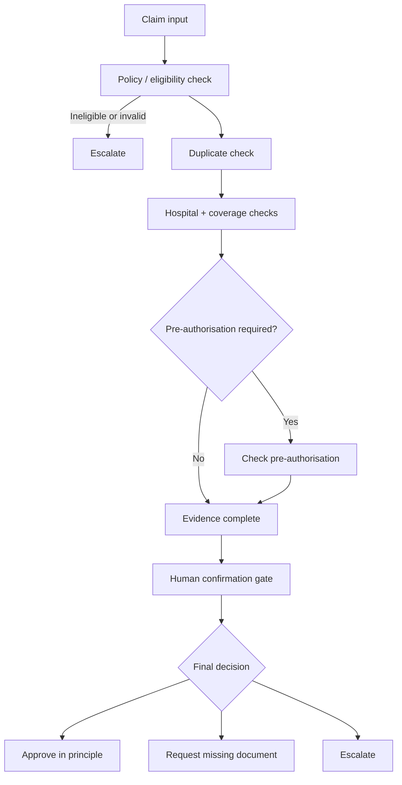
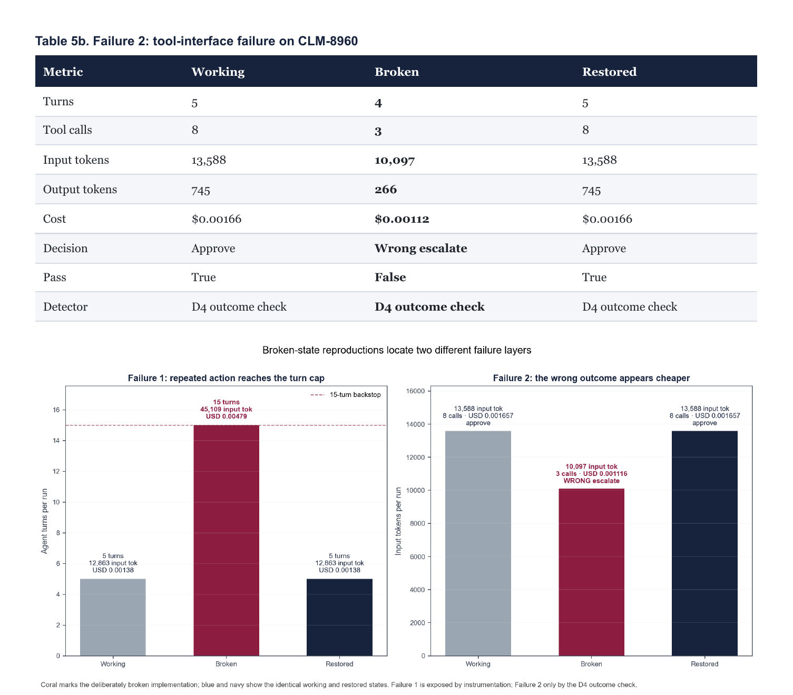
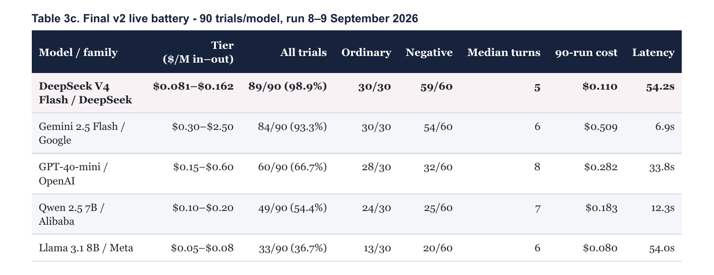
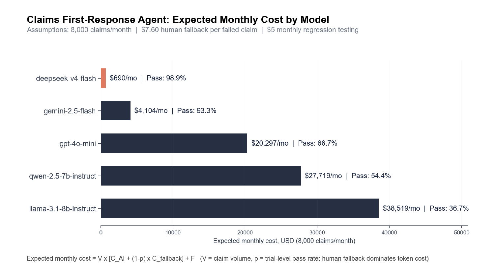

# Health Insurance Claim First-Response AI Agent

> A team-built ReAct agent for insurance claim first response, with my work focused on **LLM/Agent evaluation, failure analysis, and deployment economics**.

## Overview

This project was developed for NTU's **PE6201 Emerging AI Technologies** course.

The system handles the **first-response stage of health insurance claims**. Given claim information such as member details, hospital, service date, and line items, a single-agent ReAct workflow retrieves authoritative records and decides whether to:

- approve the claim in principle,
- request a specific missing document, or
- escalate the case to a human assessor.

The team chose a single-agent ReAct architecture because the evidence path is not fixed: later observations can change what the agent needs to check next, and different claims require different numbers of turns and tool calls.

## System Workflow

The final write action remains gated: the agent can investigate autonomously, but a human confirmation step is retained before the structured decision is issued.

---

## Team Scope

As a team, we worked on:

- designing the single-agent ReAct workflow,
- implementing tool-based checks for policy, coverage, pre-authorisation, hospital status, and duplicate claims,
- building a **50-case evaluation set** with ordinary and negative cases,
- running a controlled live-model comparison across five model families,
- analysing workflow failures and guardrail behaviour,
- measuring turns, tool calls, token usage, latency, and deployment cost,
- testing the effect of tool-interface and workflow changes.

The final evaluation used **50 cases**: 30 ordinary cases and 20 negative cases. Negative cases were repeated three times, producing **90 trials per model** in the live battery.

**Traceable evidence:** [case design and run arithmetic](https://github.com/Lapis0x0/pe6201-claims-agent/blob/main/docs/d4_case_notes.md) · [expected outcomes](https://github.com/Lapis0x0/pe6201-claims-agent/blob/main/expected_outcomes_A.json) · [verification script](https://github.com/Lapis0x0/pe6201-claims-agent/blob/main/scripts/verify_submission.py)

---

## My Contribution

My contribution focused on **evaluation and deployment economics**.

### 1. Evaluation Design

- Designed **6 boundary / limit cases** within the team's **50-case benchmark**.
- Focused on difficult policy, coverage, duplicate-claim, and pre-authorisation conditions.
- Participated in cross-review and live-model evaluation.
- Used evaluation results to analyse reliability beyond average accuracy alone.

### 2. Model & Failure Analysis

I contributed to analysing where models failed or became operationally unreliable.

The evaluation considered:

- task success,
- boundary-case behaviour,
- incorrect approval or escalation,
- repeated / inefficient tool usage,
- model consistency,
- human fallback requirements.

A key takeaway was that **pass rate alone is not sufficient**. One deliberately broken configuration still reached a safe final outcome, but took 15 turns and substantially more tokens; another looked cheaper while producing the wrong decision.

**Traceable evidence:** [reproduced failures](https://github.com/Lapis0x0/pe6201-claims-agent/blob/main/docs/d7_failures.md) · [judgement-check findings](https://github.com/Lapis0x0/pe6201-claims-agent/blob/main/docs/d4_judgement_checks.md)

---

## Live Model Evaluation

The team ran the same final prompt, code version, case set, and trial policy across five model families; only the model changed.

The final live battery showed a large spread in reliability, especially on negative cases. DeepSeek V4 Flash achieved the highest trial pass rate at **89/90 (98.9%)**, followed by Gemini 2.5 Flash at **84/90 (93.3%)**.

**Traceable evidence:** [five-model live battery](https://github.com/Lapis0x0/pe6201-claims-agent/blob/main/docs/d5b_live_battery.md) · [committed result files](https://github.com/Lapis0x0/pe6201-claims-agent/tree/main/results)

The comparison reinforced an important AI-product lesson: **ordinary cases can make several models look viable, while negative cases reveal the reliability differences that matter most for deployment**.

---

## Deployment Economics

I built a **three-layer AI cost model and token / cost ledger** connecting model performance with deployment economics.

The framework considers:

1. **Model inference cost**
2. **Expected human fallback cost**
3. **Fixed monitoring / maintenance cost**

I also worked on:

- sensitivity analysis,
- break-even analysis,
- model quality vs. cost comparison,
- monthly deployment cost modelling.

Under the assignment assumptions of **8,000 claims per month** and **US$7.60 human fallback cost per failed claim**, the final model comparison estimated:

- **DeepSeek V4 Flash:** ~US$690/month
- **Gemini 2.5 Flash:** ~US$4,104/month
- **GPT-4o-mini:** ~US$20,297/month
- **Qwen 2.5 7B:** ~US$27,719/month
- **Llama 3.1 8B:** ~US$38,519/month

**Traceable evidence:** [cost assumptions and method](https://github.com/Lapis0x0/pe6201-claims-agent/blob/main/docs/d6_notes.md) · [reproducible cost model](https://github.com/Lapis0x0/pe6201-claims-agent/blob/main/scripts/d6_cost_model.py)

The main economic insight was that **human fallback dominated token cost**. A model with cheaper inference could still be more expensive at the system level if its lower success rate created substantially more human handling.

> **Note:** These are modeled estimates under course-assignment assumptions, not realised savings from a production insurance company.

---

## Product Perspective

This project changed how I think about evaluating AI products.

The question is not simply:

> "Which model is the most accurate?"

A deployment decision also needs to ask:

- What happens when the model fails?
- Which errors require human review?
- Are the agent's tool-use trajectories stable?
- Does a cheaper model create more downstream operational cost?
- Which failures should be fixed with guardrails or interface constraints rather than prompting?
- Is the system safe enough to automate the final action?

I therefore think about AI deployment across:

**Quality × Reliability × Cost × Human Fallback × Deployment Scale**

rather than model accuracy in isolation.

---

## Key Takeaways

- Evaluation datasets should deliberately include difficult boundary and negative cases, not only normal flows.
- Agent quality should be measured at both the **final-answer level** and the **workflow level**.
- Instrumentation matters: turns, tool calls, tokens, and guard triggers can expose failures that pass rate misses.
- Token optimisation is useful, but human fallback can dominate the business case.
- The cheapest model at the API level is not necessarily the cheapest model at the system level.
- For this prototype, **human confirmation remains necessary before the final claim decision is written**.

---

## Team Demo

**[Watch the Team Demo](https://www.youtube.com/watch?v=BoABxRL6Eu0)**

This is a team product walkthrough. My contribution focused on **evaluation design, model analysis, AI cost modelling, and deployment economics**.

---

## Original Team Repository

This repository is a personal case study documenting my contribution to a collaborative project.

**[Original team repository - Lapis0x0/pe6201-claims-agent](https://github.com/Lapis0x0/pe6201-claims-agent)**

---

## Topics

`AI Agents` · `LLM Evaluation` · `ReAct` · `Failure Analysis` · `AI Product` · `Cost Modeling` · `Human-in-the-Loop` · `Deployment Economics`

---

## Author

**Liu Weiqi**  
MSc in Artificial Intelligence for Enterprise @ NTU Singapore

[LinkedIn](https://www.linkedin.com/in/liu-weiqi/)

